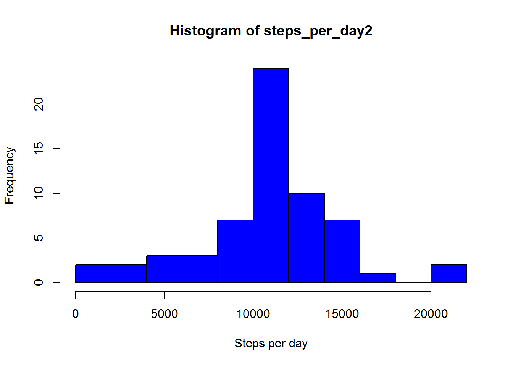
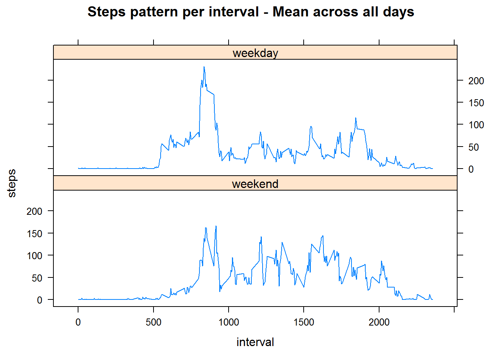

##Assignment for Week 2 coursera course Reproducible Research 

##Part 1
Loading and preprocessing the data


```r
# set working directory where the file activity is
#setwd("C:/Users/...")

rawd <- read.csv("activity.csv")

# see dimensions, names of columns and structure of the dataset
dim(rawd)
```

```
## [1] 17568     3
```

```r
names(rawd)
```

```
## [1] "steps"    "date"     "interval"
```

```r
str(rawd)
```

```
## 'data.frame':	17568 obs. of  3 variables:
##  $ steps   : int  NA NA NA NA NA NA NA NA NA NA ...
##  $ date    : Factor w/ 61 levels "2012-10-01","2012-10-02",..: 1 1 1 1 1 1 1 1 1 1 ...
##  $ interval: int  0 5 10 15 20 25 30 35 40 45 ...
```

```r
# dates seems to be off, transform from factors to dates

rawd$date <- as.Date(rawd$date)
```

##Part 2
Calculate total steps per day  
Plot histogram  
Report mean and median  


```r
steps_per_day <- tapply(rawd$steps,rawd$date ,sum)

print(as.table(steps_per_day),type="html")
```

```
## 2012-10-01 2012-10-02 2012-10-03 2012-10-04 2012-10-05 2012-10-06 
##                   126      11352      12116      13294      15420 
## 2012-10-07 2012-10-08 2012-10-09 2012-10-10 2012-10-11 2012-10-12 
##      11015                 12811       9900      10304      17382 
## 2012-10-13 2012-10-14 2012-10-15 2012-10-16 2012-10-17 2012-10-18 
##      12426      15098      10139      15084      13452      10056 
## 2012-10-19 2012-10-20 2012-10-21 2012-10-22 2012-10-23 2012-10-24 
##      11829      10395       8821      13460       8918       8355 
## 2012-10-25 2012-10-26 2012-10-27 2012-10-28 2012-10-29 2012-10-30 
##       2492       6778      10119      11458       5018       9819 
## 2012-10-31 2012-11-01 2012-11-02 2012-11-03 2012-11-04 2012-11-05 
##      15414                 10600      10571                 10439 
## 2012-11-06 2012-11-07 2012-11-08 2012-11-09 2012-11-10 2012-11-11 
##       8334      12883       3219                            12608 
## 2012-11-12 2012-11-13 2012-11-14 2012-11-15 2012-11-16 2012-11-17 
##      10765       7336                    41       5441      14339 
## 2012-11-18 2012-11-19 2012-11-20 2012-11-21 2012-11-22 2012-11-23 
##      15110       8841       4472      12787      20427      21194 
## 2012-11-24 2012-11-25 2012-11-26 2012-11-27 2012-11-28 2012-11-29 
##      14478      11834      11162      13646      10183       7047 
## 2012-11-30 
## 
```

```r
# note that NAs are ignored here and therefore are not set to zero!

# plot historgram with 10 intervals
hist(steps_per_day,10,col="red",xlab="Steps per day")
```


```r
# calculate mean and median
mean_steps <- mean(steps_per_day,na.rm=TRUE)
median_steps <- median(steps_per_day,na.rm=TRUE)
```

Mean steps per day is 1.0766189 &times; 10<sup>4</sup>.   
Median steps per day is 10765.  

##Part 3
Plot steps for each 5 minute interval  
Find max steps interval  


```r
# get sum of steps per interval for all days
steps_per_interval <- (tapply(rawd$steps,rawd$interval ,mean ,na.rm=TRUE))

# plot pattern

plot(y=steps_per_interval,x=names(steps_per_interval), type="l",
     xlab="5-minute intervals",ylab="steps per interval")
title("Steps pattern per interval - Mean across all days")
```


```r
# get max
max_interval <- names(which(steps_per_interval==max(steps_per_interval)))
```

 The interval with maximum average steps taken per day is 835. i.e. at 8:35 morning.  


##PArt 4A  
missing data handling  


```r
na_rows <- rawd

na_rows <- is.na(rawd$steps)
total_na <- sum(na_rows)

# The strategy to fill in the missing data is to use the mean for that 5-minute interval.
# make a copy of raw data

rawd2 <- rawd

for (ii in 1:length(na_rows)) {
        
        if (na_rows[ii]==TRUE) {
                
                ps_interval <- rawd$interval[ii]
                ps_position <- which(names(steps_per_interval)==ps_interval)
                
                rawd2$steps[ii] <- steps_per_interval[ps_position][[1]]
        }
        
}
```

The total number of rows with missing data is 2304.  

The strategy to fill in the missing data is to use the mean for that 5-minute interval.  

The updated dataset is saved as rawd2.

##PArt 4B
histogram  
mean and median  


```r
steps_per_day2 <- tapply(rawd2$steps,rawd2$date ,sum )

# plot historgram with 10 intervals
hist(steps_per_day2,10,col="blue",xlab="Steps per day")
```



```r
# let's compare this with previous histogram
par(mfrow=c(1,2))
hist(steps_per_day,10,col="red",ylim=c(0,20),main="Original Data",xlab="Steps per day")
hist(steps_per_day2,10,col="blue",ylim=c(0,20),main="Updated Data",xlab="Steps per day")
```


```r
# more steps are registered towards the middle of the histogram
# this is expected since the strategy was to fill missing data with the mean.

# calculate mean and median
mean_steps2   <- mean(steps_per_day2)
median_steps2 <- median(steps_per_day2)
```

Mean steps per day with updated data is 1.0766189 &times; 10<sup>4</sup>.  
Median steps per day with updated data is 1.0766189 &times; 10<sup>4</sup>.  

Mean before updating data was 1.0766189 &times; 10<sup>4</sup>.    
Median before updating data was 10765.  

Mean hasn't changed at all, since all the NAs were for WHOLE days, therefore the missing values were  
replaced with already calculated mean values from other days. Hence the total mean is unchanged.  

Median has slighly increased leaning towards the mean, but not a big impact. Reason is same as above.  


```r
print(as.table(steps_per_day2),type="html")
```

```
## 2012-10-01 2012-10-02 2012-10-03 2012-10-04 2012-10-05 2012-10-06 
##   10766.19     126.00   11352.00   12116.00   13294.00   15420.00 
## 2012-10-07 2012-10-08 2012-10-09 2012-10-10 2012-10-11 2012-10-12 
##   11015.00   10766.19   12811.00    9900.00   10304.00   17382.00 
## 2012-10-13 2012-10-14 2012-10-15 2012-10-16 2012-10-17 2012-10-18 
##   12426.00   15098.00   10139.00   15084.00   13452.00   10056.00 
## 2012-10-19 2012-10-20 2012-10-21 2012-10-22 2012-10-23 2012-10-24 
##   11829.00   10395.00    8821.00   13460.00    8918.00    8355.00 
## 2012-10-25 2012-10-26 2012-10-27 2012-10-28 2012-10-29 2012-10-30 
##    2492.00    6778.00   10119.00   11458.00    5018.00    9819.00 
## 2012-10-31 2012-11-01 2012-11-02 2012-11-03 2012-11-04 2012-11-05 
##   15414.00   10766.19   10600.00   10571.00   10766.19   10439.00 
## 2012-11-06 2012-11-07 2012-11-08 2012-11-09 2012-11-10 2012-11-11 
##    8334.00   12883.00    3219.00   10766.19   10766.19   12608.00 
## 2012-11-12 2012-11-13 2012-11-14 2012-11-15 2012-11-16 2012-11-17 
##   10765.00    7336.00   10766.19      41.00    5441.00   14339.00 
## 2012-11-18 2012-11-19 2012-11-20 2012-11-21 2012-11-22 2012-11-23 
##   15110.00    8841.00    4472.00   12787.00   20427.00   21194.00 
## 2012-11-24 2012-11-25 2012-11-26 2012-11-27 2012-11-28 2012-11-29 
##   14478.00   11834.00   11162.00   13646.00   10183.00    7047.00 
## 2012-11-30 
##   10766.19
```

```r
# New steps per day can be seen above. The impact is that the sum of total steps is obviously higher now
# Also, you can see that days where there was no steps registered before, are now filled with steps.
```

## PArt 5
Weekdays examination  
weekday vs weekend  


```r
library(lattice)

# add a new columnn indicating weekend or weekday
rawd2$days <- weekdays(rawd2$date)
rawd2$days <- ifelse(rawd2$days=="Sunday" | rawd2$days=="Saturday", "weekend","weekday")
rawd2$days <- as.factor(rawd2$days)

# Let's see the new variable
head(rawd2)
```

```
##       steps       date interval    days
## 1 1.7169811 2012-10-01        0 weekday
## 2 0.3396226 2012-10-01        5 weekday
## 3 0.1320755 2012-10-01       10 weekday
## 4 0.1509434 2012-10-01       15 weekday
## 5 0.0754717 2012-10-01       20 weekday
## 6 2.0943396 2012-10-01       25 weekday
```

```r
str(rawd2$days)
```

```
##  Factor w/ 2 levels "weekday","weekend": 1 1 1 1 1 1 1 1 1 1 ...
```

```r
# split data into two and calculate mean per interval
weekend <- rawd2[rawd2$days=="weekend",]
weekdays <- rawd2[rawd2$days=="weekday",]

steps_weekend <- (tapply(weekend$steps,weekend$interval ,mean ,na.rm=TRUE))
steps_weekdays <- (tapply(weekdays$steps,weekdays$interval ,mean ,na.rm=TRUE))

# make them data frame
steps_weekend <- data.frame(names(steps_weekend),steps_weekend,rep("weekend",length(steps_weekend)))
steps_weekdays <- data.frame(names(steps_weekdays),steps_weekdays,rep("weekday",length(steps_weekdays)))
names(steps_weekend) <- c("interval","steps","days")
names(steps_weekdays) <- c("interval","steps","days")

# join them
steps_days <- rbind(steps_weekend, steps_weekdays)
steps_days$interval <- as.numeric(as.character(steps_days$interval))

# see part of the result
head(steps_days)
```

```
##    interval       steps    days
## 0         0 0.214622642 weekend
## 5         5 0.042452830 weekend
## 10       10 0.016509434 weekend
## 15       15 0.018867925 weekend
## 20       20 0.009433962 weekend
## 25       25 3.511792453 weekend
```

```r
# plot pattern

xyplot(steps ~ interval | days, data = steps_days, type="l", layout = c(1, 2),
       main = "Steps pattern per interval - Mean across all days")
```




